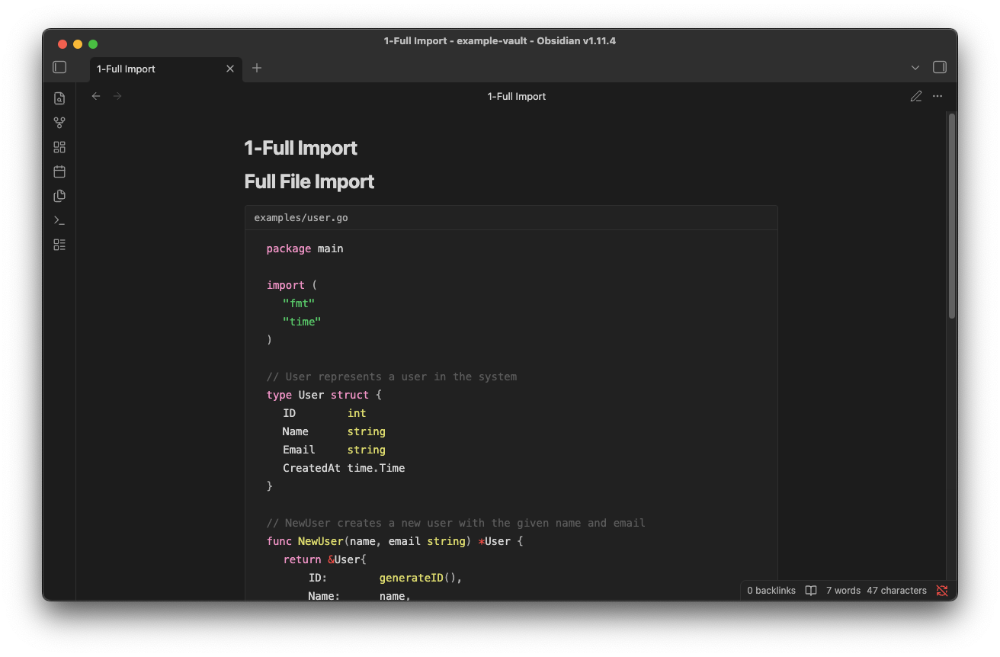
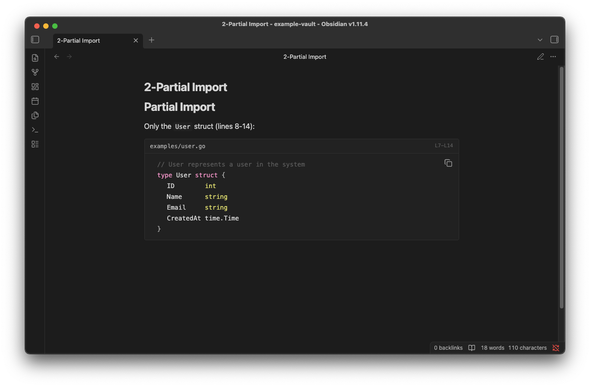
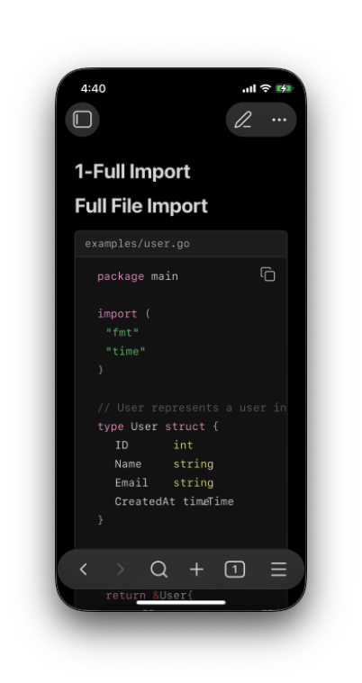
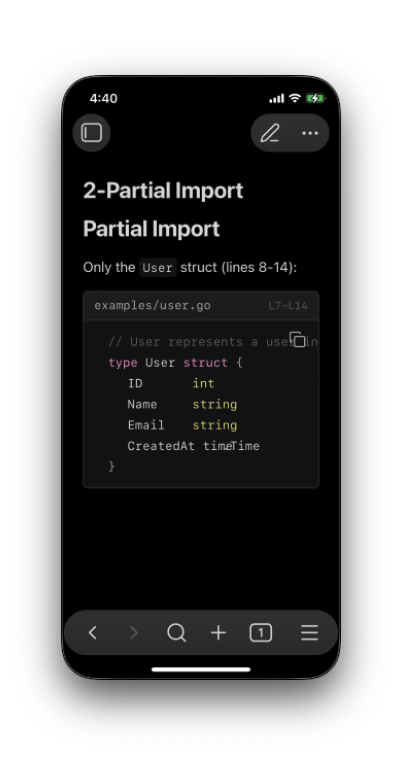

# Code Import Plugin for Obsidian

Import external code files in your Obsidian notes using `@import` syntax (compatible with [Foam](https://github.com/foambubble/foam) / [Markdown Preview Enhanced](https://github.com/shd101wyy/vscode-markdown-preview-enhanced)).

## Screenshots

### Desktop

**Full file import:**



**Partial import (specific lines):**



### Mobile (iOS)

| Full import | Partial import |
|-------------|----------------|
|  |  |

## Features

- Import code files directly in Reading View
- Support line range selection (`line_begin`, `line_end`)
- Automatic syntax highlighting based on file extension
- Works with relative paths (including `../`)

## Syntax

```markdown
@import "path/to/file.go"
@import "path/to/file.go" {line_begin=4 line_end=14}
@import "examples/main.py" {line_begin=10}
@import "config.yaml" {line_end=-4}
```

### Parameters

| Parameter | Description | Example |
|-----------|-------------|---------|
| `line_begin` | Start line (0-based index) | `line_begin=4` starts from 5th line |
| `line_end` | End line (exclusive, supports negative) | `line_end=14` or `line_end=-1` |

### Line Index Examples

- `{line_begin=0 line_end=10}` → Lines 1-10 (indices 0-9)
- `{line_begin=5}` → From line 6 to end
- `{line_end=-2}` → From start, excluding last 2 lines

## Installation

### From Community Plugins

1. Open Settings → Community plugins
2. Search for "Code Import"
3. Install and enable

### Manual Installation

1. Download `main.js`, `manifest.json`, `styles.css` from [Releases](../../releases)
2. Create folder: `<vault>/.obsidian/plugins/code-import/`
3. Copy the files into the folder
4. Enable the plugin in Settings → Community plugins

## Usage

1. Place your code files in your vault (or reference them with relative paths)
2. Add `@import` directive in your markdown file
3. Switch to Reading View to see the imported code

### Example

In your markdown file:
```markdown
## User Struct Definition

@import "examples/user.go" {line_begin=10 line_end=25}
```

## Settings

| Setting | Description | Default |
|---------|-------------|---------|
| Show file name | Display filename header above code block | On |
| Wrap code | Wrap long lines instead of horizontal scrolling | Off |

## License

[MIT](LICENSE)
